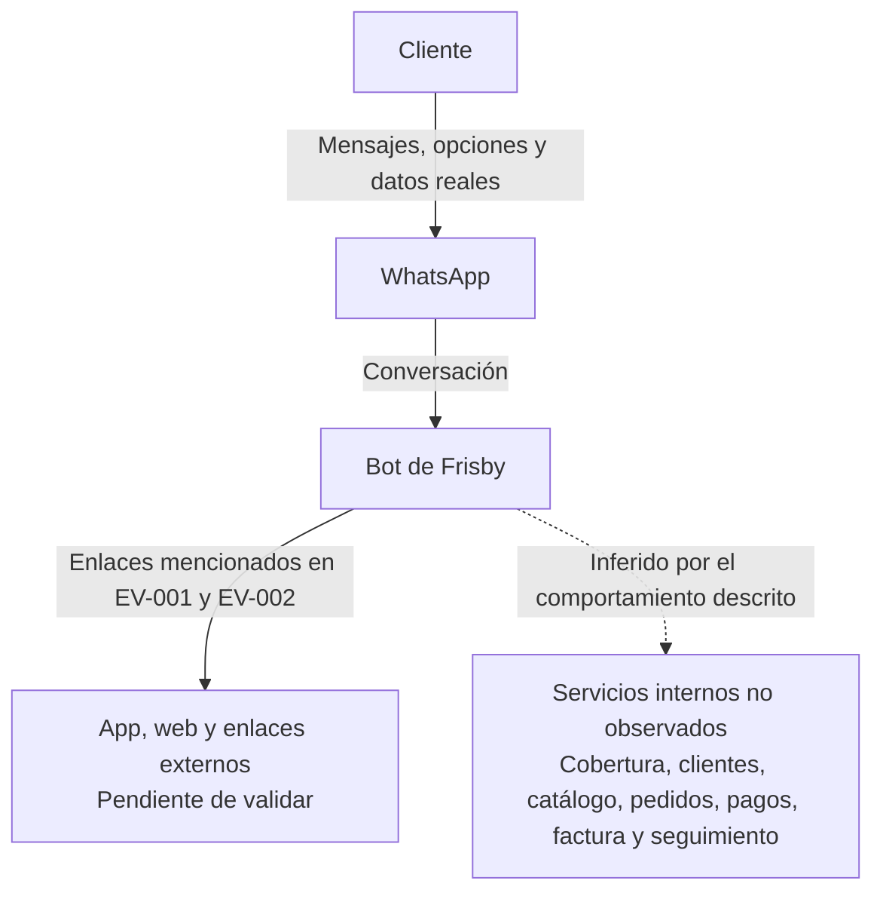
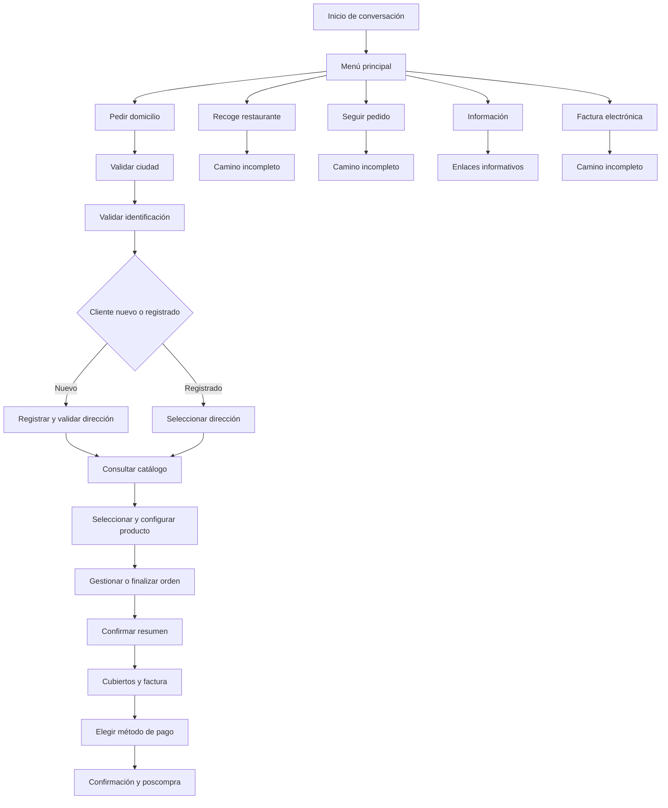

# Descubrimiento del Bot de Referencia Frisby

**Estado:** En progreso  
**Fecha de inicio:** 2026-08-19  
**Última actualización:** 2026-08-20  
**Responsable funcional:** Analista Funcional  
**Validación funcional:** Sr. Wolfan

---

## 1. Cómo leer este documento

Consolidar el inventario, contexto, capacidades, escenarios, flujos, vacíos y cobertura del bot de referencia para construir el espejo interno de Pipe.

Los archivos existentes son fuentes secundarias por contrastar. Hasta realizar recorridos controlados en WhatsApp, sus afirmaciones sobre el comportamiento del bot se clasifican como **Pendientes**. La existencia y el contenido de los archivos sí están confirmados.

Estados utilizados:

- **Confirmado:** observado directamente y respaldado por evidencia identificada.
- **Inferido:** conclusión razonable que todavía no fue observada directamente.
- **Pendiente:** información mencionada o esperada que requiere validación.

---

## 2. Insumos analizados

| ID | Fuente | Tipo | Cobertura declarada | Estado | Observación |
|---|---|---|---|---|---|
| EV-001 | `inputs/frisby/FRISBY_1.MD` | Análisis narrativo fechado internamente el 2026-08-06 | Menú, domicilio, compra, recogida, seguimiento, información, factura y poscompra | Disponible; pendiente de contrastar | Detalla un recorrido de compra y resume otros caminos; contiene datos reales |
| EV-002 | `inputs/frisby/FRISBY_2.HTM` | Diagramas y tablas HTML | Menú, domicilio, compra y validaciones | Disponible; pendiente de contrastar | Su contenido coincide ampliamente con EV-001 y no constituye confirmación independiente |

### 2.1 Tratamiento de los insumos

EV-001 y EV-002 están ubicados en `docs/01-discovery/inputs/frisby/` y excluidos del control de versiones porque contienen datos reales sin enmascarar. Se explotan como un único conjunto documental: EV-002 representa visualmente gran parte de EV-001 y no aumenta por sí solo el nivel de confirmación.

### 2.2 Cobertura documental de los insumos

| Área | Contenido extraído | Cobertura documental | Estado |
|---|---|---|---|
| Inicio | Saludo y menú con cinco opciones | Resumen y diagrama | Pendiente |
| Domicilio — cliente nuevo | Ciudad, identificación, aviso de número nuevo, tipo de ubicación, dirección, confirmaciones y cobertura | Detallada hasta llegar al menú | Pendiente |
| Domicilio — cliente registrado | Ciudad, identificación y selección entre direcciones guardadas o registro de una nueva | Detallada para una dirección guardada | Pendiente |
| Catálogo | Once categorías y ocho productos de Pollo Apanado | Detallada para una sola categoría | Pendiente |
| Configuración de producto | Bebida, agrandado y dos selecciones de salsa | Detallada para un producto | Pendiente |
| Gestión de orden | Agregar otro producto, gestionar o finalizar | Solo se desarrolla la finalización | Pendiente |
| Cierre de compra | Venta adicional, observaciones, resumen, cubiertos, factura, método de pago y confirmación | Detallada para un camino con datáfono | Pendiente |
| Poscompra | Promesa de entrega y enlace posterior de calificación | Un solo caso narrado | Pendiente |
| Recogida en restaurante | Confirmación del restaurante | Inicio del camino | Pendiente |
| Seguimiento | Solicitud del teléfono y respuesta genérica de estado | Inicio del camino | Pendiente |
| Información | Línea de atención y cinco enlaces | Resumen sin navegación | Pendiente |
| Factura electrónica | Confirmación para iniciar registro | Inicio del camino | Pendiente |

- **Con mayor detalle documental:** domicilio para cliente nuevo, domicilio para cliente registrado y una finalización de compra.
- **Parcial:** catálogo, gestión de orden, pago y mensaje posterior a la compra.
- **Con información mínima:** recogida, seguimiento, información y factura electrónica.
- **Sin validación directa actual:** todos los escenarios.

La afirmación de EV-002 de que las cinco opciones fueron exploradas por completo no se considera confirmada porque varios caminos solo contienen sus primeros pasos.

---

## 3. Qué encontramos en los insumos

Todo lo registrado en esta sección describe lo que afirman EV-001 y EV-002. Su estado es **Pendiente** hasta contrastarlo directamente en WhatsApp.

### 3.1 Capacidades identificadas

| ID | Capacidad de negocio | Capacidades funcionales mencionadas | Estado | Evidencia |
|---|---|---|---|---|
| CAP-01 | Realizar un pedido a domicilio | Validar ciudad, cliente y dirección; consultar catálogo; configurar productos; gestionar orden; elegir pago; confirmar pedido | Pendiente | EV-001, EV-002 |
| CAP-02 | Recoger un pedido en restaurante | Confirmar o cambiar el restaurante y continuar el pedido | Pendiente | EV-001, EV-002 |
| CAP-03 | Consultar el estado de un pedido | Identificar el pedido mediante teléfono y presentar su estado | Pendiente | EV-001, EV-002 |
| CAP-04 | Consultar información de Frisby | Presentar enlaces de restaurantes, novedades, empresa, contacto y SIC | Pendiente | EV-001, EV-002 |
| CAP-05 | Solicitar factura electrónica | Confirmar intención y registrar datos para facturación | Pendiente | EV-001, EV-002 |
| CAP-06 | Calificar la experiencia | Enviar un enlace de evaluación después de la compra | Pendiente | EV-001, EV-002 |

### 3.2 Datos del catálogo y la compra documentada

| ID | Dato extraído | Valor documentado | Evidencia | Estado |
|---|---|---|---|---|
| DAT-001 | Opciones del menú principal | Pedir domicilio; Recoge restaurante; Seguir pedido; Información; Fact. electrónica | EV-001, EV-002 | Pendiente |
| DAT-002 | Categorías del menú de comidas | Promociones; Pollo Apanado; Pollo BBQ; Combos; Hamburguesas; Frisdelicias; Ensaladas y Bio; Frisby Kids; Acompañantes; Bebidas; Solidario | EV-001 | Pendiente |
| DAT-003 | Productos documentados de Pollo Apanado | Cuarto Frisby arepas $19.500; Medio Frisby arepas $32.800; Pollo Frisby arepas $59.900; Familiar Frisby arepas $85.100; Cuarto Frisby francesa $23.000; Medio Frisby francesa $41.800; Pollo Frisby francesa $74.400; Familiar Frisby francesa $101.600 | EV-001 | Pendiente |
| DAT-004 | Bebidas opcionales | Pepsi, Colombiana o Manzana de 1,5 litros a $7.900; opción sin bebida | EV-001 | Pendiente |
| DAT-005 | Agrandado opcional | Dos presas por $11.900; una presa por $7.900; opción sin agrandado | EV-001 | Pendiente |
| DAT-006 | Salsas mencionadas | Miel, tomate, búfalo sriracha, blanca, rosada, miel mostaza, mostaneza BBQ, BBQ, coreana, miel picante y Nashville; opciones sin salsa | EV-001 | Pendiente |
| DAT-007 | Venta adicional antes del cierre | Postres $9.900; plátano maduro $12.500; trozos de mazorca dulce $11.900; opción no agregar | EV-001, EV-002 | Pendiente |
| DAT-008 | Métodos de pago | Efectivo, datáfono, pago electrónico y PSE | EV-001, EV-002 | Pendiente |
| DAT-009 | Valores del caso de compra | Producto $59.900; domicilio $6.000; total $65.900 | EV-001, EV-002 | Pendiente |
| DAT-010 | Tiempos declarados | Promesa aproximada de entrega de 45 minutos; calificación posterior con tiempo inconsistente entre relato y marcas horarias | EV-001, EV-002 | Pendiente |
| DAT-011 | Presentación del producto recorrido | Imagen; nombre “Pollo Frisby arepas”; descripción de 8 presas apanadas y 10 arepas; precio $59.900 | EV-001, EV-002 | Pendiente |
| DAT-012 | Canales de contacto y registro mencionados | Línea 301 555 5555; registro por app, web o `wa.me/573015555555` | EV-001, EV-002 | Pendiente |
| DAT-013 | Enlaces informativos documentados | Restaurantes `https://botm.cc/l/11qYiUG`; Novedades `https://botm.cc/l/11OjVoc`; Sobre nosotros `https://botm.cc/l/11C6F6We`; Contáctanos `https://botm.cc/l/11PbjBf0`; SIC `https://botm.cc/l/11cIaHNG` | EV-001 | Pendiente |
| DAT-014 | Enlace de calificación documentado | `https://botm.cc/l/11kzxoRr` | EV-001 | Pendiente |
| DAT-015 | Hitos horarios del caso narrado | Inicio 13:00; pedido confirmado 13:04; calificación 15:04 | EV-001 | Pendiente |
| DAT-016 | Formatos de entrada mencionados | Ciudad en texto; identificación sin símbolos ni puntos; dirección en texto libre; selección de dirección guardada mediante número | EV-001 | Pendiente |
| DAT-017 | Controles de navegación mencionados | Categorías y productos por letra; confirmaciones Sí/No; opción de regresar al menú anterior en productos; palabra “menú” desde seguimiento | EV-001 | Pendiente |
| DAT-018 | Rasgos de comunicación atribuidos | Presentación como asistente virtual, uso frecuente de emojis y mensajes de validación, éxito, sostenibilidad y despedida | EV-001 | Pendiente |
| DAT-019 | Configuración del caso de compra | Sin bebida; sin agrandado; salsa miel mostaza; miel picante; sin observaciones; sin cubiertos; sin factura; pago con datáfono | EV-001, EV-002 | Pendiente |
| DAT-020 | Estimaciones comparativas de la fuente | Cliente nuevo: 10 pasos, 3–5 minutos y 15–20 mensajes; registrado: 6 pasos, 1–2 minutos y 8–10 mensajes | EV-001, EV-002 | Pendiente |

Los precios y opciones son una fotografía documental fechada; no se consideran vigentes hasta validarlos en WhatsApp.

### 3.3 Reglas candidatas

| ID | Regla candidata | Evidencia | Estado |
|---|---|---|---|
| REG-001 | La opción de domicilio informa una promesa aproximada de 45 minutos al inicio y al confirmar | EV-001 | Pendiente |
| REG-002 | La cobertura se valida primero por ciudad y después por dirección | EV-001, EV-002 | Pendiente |
| REG-003 | La identificación ingresada determina un camino de cliente nuevo o registrado | EV-001, EV-002 | Pendiente |
| REG-004 | Un cliente registrado puede seleccionar una dirección guardada o iniciar el registro de otra | EV-001, EV-002 | Pendiente |
| REG-005 | Un cliente nuevo debe indicar tipo de ubicación, dirección y confirmarla antes de consultar el menú | EV-001, EV-002 | Pendiente |
| REG-006 | La configuración del producto depende de opciones de bebida, agrandado y salsas | EV-001, EV-002 | Pendiente |
| REG-007 | Después de agregar un producto se puede agregar otro, gestionar o finalizar la orden | EV-001 | Pendiente |
| REG-008 | Antes del cierre se ofrece una venta adicional | EV-001, EV-002 | Pendiente |
| REG-009 | El usuario puede agregar observaciones y debe confirmar el resumen de la orden | EV-001, EV-002 | Pendiente |
| REG-010 | Después de confirmar el resumen se pregunta por cubiertos y factura electrónica | EV-001, EV-002 | Pendiente |
| REG-011 | El método de pago se selecciona antes de procesar y confirmar el pedido | EV-001, EV-002 | Pendiente |
| REG-012 | El seguimiento solicita el teléfono utilizado en el pedido | EV-001 | Pendiente |
| REG-013 | La palabra “menú” permitiría regresar al inicio desde seguimiento | EV-001 | Pendiente |
| REG-014 | La factura electrónica también existe como opción independiente del menú principal | EV-001, EV-002 | Pendiente |
| REG-015 | Después de la compra se envía un enlace de calificación | EV-001, EV-002 | Pendiente |
| REG-016 | La identificación se solicita sin símbolos ni puntos | EV-001 | Pendiente |
| REG-017 | La dirección de un cliente nuevo se confirma antes de validar cobertura y vuelve a confirmarse después de esa validación | EV-001, EV-002 | Pendiente |
| REG-018 | La lista de direcciones de un cliente registrado reserva la opción 0 para registrar una nueva dirección | EV-001, EV-002 | Pendiente |
| REG-019 | Antes de configurar opcionales, el bot muestra imagen, descripción y precio del producto y solicita confirmación para agregarlo | EV-001 | Pendiente |
| REG-020 | El producto recorrido solicita bebida, agrandado, salsa 1 y salsa 2 en ese orden | EV-001, EV-002 | Pendiente |
| REG-021 | El submenú de productos incluye una opción para regresar al menú anterior | EV-001 | Pendiente |
| REG-022 | La finalización del pedido sigue el orden: venta adicional, observaciones, resumen, cubiertos, factura, pago y confirmación | EV-001, EV-002 | Pendiente |
| REG-023 | La confirmación de entrega advierte que la promesa puede cambiar por condiciones ajenas al restaurante | EV-001 | Pendiente |
| REG-024 | La opción de información entrega cinco enlaces y una línea de atención | EV-001 | Pendiente |
| REG-025 | La facturación independiente solicita confirmar si se desea continuar antes del registro de datos | EV-001, EV-002 | Pendiente |

### 3.4 Vacíos, anomalías e inconsistencias

| ID | Hallazgo | Impacto en la validación |
|---|---|---|
| ANM-001 | EV-002 afirma que las cinco opciones fueron exploradas completamente, pero cuatro caminos contienen únicamente pasos iniciales | No aceptar la cobertura declarada sin WhatsApp |
| ANM-002 | La rama se describe como detección de “número nuevo”, aunque la decisión ocurre después de ingresar una identificación | Confirmar qué dato determina realmente el tipo de cliente |
| ANM-003 | La opción de registrar nueva dirección para cliente registrado aparece, pero su recorrido no está documentado | Recorrerla como escenario independiente |
| ANM-004 | Recogida asume un restaurante preseleccionado sin explicar cómo fue elegido | Identificar el paso anterior y las alternativas |
| ANM-005 | El checkout indica que la factura usa datos suministrados al inicio, pero esos datos completos no aparecen en el recorrido | Confirmar origen y validaciones de los datos fiscales |
| ANM-006 | Solo se desarrolla el pago con datáfono; efectivo, pago electrónico y PSE quedan sin resultado | Validar cada método y sus errores |
| ANM-007 | El texto dice que la encuesta llega tres horas después, pero las marcas horarias descritas representan aproximadamente dos horas | Medir el comportamiento real y registrar la condición |
| ANM-008 | Los tiempos y cantidades de mensajes para clientes nuevos y registrados son estimaciones sin trazabilidad independiente | No utilizarlos como criterio hasta medir recorridos reales |
| ANM-009 | EV-002 dibuja rechazos por falta de cobertura o dirección inválida, pero EV-001 no contiene las respuestas reales de esas ramas | Tratar los rechazos como inferidos y levantar su texto y retorno en WhatsApp |
| ANM-010 | Para recogida, EV-001 dice que cambiar de restaurante es “probable” y EV-002 lo representa como si fuera un camino observado | No asumir el selector ni sus pasos hasta recorrer la opción No |
| ANM-011 | Seguimiento termina en un marcador genérico de búsqueda y estado, sin respuesta, estados ni errores reales | Levantar resultados exitosos y fallidos |
| ANM-012 | Facturación representa registro de datos o regreso, pero no documenta campos, validaciones ni mensajes posteriores | Recorrer por separado las respuestas Sí y No |
| ANM-013 | EV-002 resume cuatro tipos de opcionales, mientras EV-001 describe tres tipos funcionales en cuatro preguntas: bebida, agrandado, salsa 1 y salsa 2 | Confirmar si el bot considera las dos salsas como grupos distintos |
| ANM-014 | La fuente atribuye identidad de “asistente virtual” y beneficios de seguridad sin reproducir el saludo completo ni evidenciar controles de seguridad | Capturar el saludo literal y no convertir afirmaciones editoriales en capacidades confirmadas |
| ANM-015 | El listado de Salsa 1 incluye dos opciones similares para no agregar salsa: “Sin salsa $0” y “Sin Salsa 1” | Confirmar si son opciones distintas, un duplicado o un error del documento |
| ANM-016 | El menú narrativo usa un automóvil para Pedir domicilio, mientras la línea de tiempo registra la misma opción con motocicleta | Capturar etiqueta y activo visual vigentes |

## 4. Qué debemos validar en WhatsApp

### 4.1 Matriz de escenarios

| ID | Escenario | Cobertura documental | Estado | Evidencia | Vacío principal |
|---|---|---|---|---|---|
| SCN-001 | Inicio y menú principal | Menú de cinco opciones | Pendiente | EV-001, EV-002 | Confirmar saludo, opciones y comportamiento ante entradas no válidas |
| SCN-002 | Pedido a domicilio de cliente nuevo | Recorrido detallado hasta dirección validada | Pendiente | EV-001, EV-002 | Validar errores, rechazos de cobertura, retrocesos y cancelación |
| SCN-003 | Pedido a domicilio de cliente registrado | Recorrido detallado con selección de dirección | Pendiente | EV-001, EV-002 | Validar nueva dirección, dirección inválida y ausencia de direcciones |
| SCN-004 | Catálogo, producto y opcionales | Un producto y sus opcionales | Pendiente | EV-001, EV-002 | Faltan categorías, productos, reglas de opcionales y disponibilidad |
| SCN-005 | Gestión y finalización de la orden | Un camino de finalización | Pendiente | EV-001, EV-002 | Validar agregar, modificar, eliminar, volver y cancelar |
| SCN-006 | Pago y confirmación | Selección de datáfono y confirmación | Pendiente | EV-001, EV-002 | Validar los demás métodos, errores y momento irreversible |
| SCN-007 | Recogida en restaurante | Solo confirmación inicial | Pendiente | EV-001, EV-002 | Falta selección de restaurante y recorrido completo |
| SCN-008 | Seguimiento de pedido | Solicitud de teléfono y resultado genérico | Pendiente | EV-001, EV-002 | Faltan estados, pedidos inexistentes, errores y retorno al menú |
| SCN-009 | Información | Cinco enlaces declarados | Pendiente | EV-001, EV-002 | Confirmar enlaces, navegación y retorno al menú |
| SCN-010 | Facturación electrónica | Solo confirmación inicial | Pendiente | EV-001, EV-002 | Falta registro completo, validaciones, resultado y cancelación |
| SCN-011 | Mensaje posterior a la compra | Enlace de calificación descrito | Pendiente | EV-001, EV-002 | Confirmar condición, momento y contenido vigente |

### 4.2 Detalle de los escenarios documentados

Las tablas conservan la secuencia y el contenido funcional de EV-001 y EV-002. La transcripción extensa permanece en los insumos para evitar duplicarla. Ningún paso está confirmado todavía. Cuando la fuente no documenta la continuación, el camino termina en **Pendiente de validar**.

Cada escenario de la matriz 4.1 tiene aquí un apartado equivalente con el mismo orden.

#### 4.2.1 SCN-001 — Inicio y menú principal

**Fuentes:** línea de tiempo de EV-001 y diagrama 1 de EV-002.

| Paso | Actor | Contenido documentado | Resultado |
|---|---|---|---|
| INI-01 | Cliente | Inicia con un saludo; el caso registra “Hola cómo estás” | Inicio de sesión |
| INI-02 | Bot | EV-002 resume “¿En qué te puedo ayudar?”; EV-001 no conserva el saludo completo | Presenta menú |
| INI-03 | Bot | Pedir domicilio; Recoge restaurante; Seguir pedido; Información; Fact. electrónica | El cliente elige una rama |
| INI-04 | Cliente | Entrada diferente a las opciones | **Pendiente de validar** |

#### 4.2.2 SCN-002 — Domicilio para cliente nuevo

**Fuentes:** sección 1.1 de EV-001 y diagramas 2, 5 y 6 de EV-002.

| Paso | Actor | Contenido documentado | Resultado |
|---|---|---|---|
| DOM-N-01 | Cliente | Selecciona Pedir domicilio | Inicia el camino |
| DOM-N-02 | Bot | Informa una promesa aproximada de 45 minutos | Solicita ciudad |
| DOM-N-03 | Cliente | Ingresa la ciudad | Bot indica que valida cobertura |
| DOM-N-04 | Bot | Solicita identificación sin símbolos ni puntos | Cliente ingresa identificación |
| DOM-N-05 | Bot | Indica que valida los datos | La fuente clasifica al cliente como nuevo |
| DOM-N-06 | Bot | Advierte que escribe desde un número nuevo y menciona registro por app, web o WhatsApp | Continúa sin registro documentado |
| DOM-N-07 | Bot | Informa que no existen direcciones registradas | Solicita registrar una |
| DOM-N-08 | Cliente | Elige Casa, Apartamento u Oficina | Bot solicita dirección |
| DOM-N-09 | Cliente | Ingresa dirección, unidad residencial u hotel en texto libre | Bot presenta la dirección para confirmar |
| DOM-N-10 | Cliente | Responde Sí | Bot indica que valida cobertura en la dirección |
| DOM-N-11 | Bot | Advierte que la ubicación puede ser cercana y vuelve a preguntar si la dirección es correcta | Cliente responde Sí |
| DOM-N-12 | Bot | Da por validada la dirección | Continúa al menú de comidas |
| DOM-N-13 | Cliente | Responde No, ingresa ciudad sin cobertura, identificación inválida o dirección rechazada | **Pendiente de validar** |

#### 4.2.3 SCN-003 — Domicilio para cliente registrado

**Fuentes:** sección 1.2 de EV-001 y diagramas 2 y 6 de EV-002.

| Paso | Actor | Contenido documentado | Resultado |
|---|---|---|---|
| DOM-R-01 | Cliente | Selecciona Pedir domicilio | Inicia el camino |
| DOM-R-02 | Bot | Informa 45 minutos, solicita ciudad y comunica la validación de cobertura | Solicita identificación |
| DOM-R-03 | Cliente | Ingresa identificación | Bot indica que valida los datos |
| DOM-R-04 | Bot | Presenta 0 para registrar una nueva dirección y números para las direcciones guardadas | Cliente elige una opción |
| DOM-R-05 | Cliente | Selecciona una dirección guardada | Continúa al menú de comidas |
| DOM-R-06 | Cliente | Selecciona 0, una opción inexistente o no tiene direcciones | **Pendiente de validar** |

#### 4.2.4 SCN-004 — Catálogo, producto y opcionales

**Fuentes:** sección 1.3 y línea de tiempo de EV-001; diagrama 3 y tabla de compra de EV-002.

| Paso | Actor | Contenido documentado | Resultado |
|---|---|---|---|
| PED-01 | Bot | Presenta once categorías de comidas | Cliente selecciona Pollo Apanado |
| PED-02 | Bot | Presenta ocho productos de Pollo Apanado y la opción Regresar al menú anterior | Cliente selecciona Pollo Frisby arepas |
| PED-03 | Bot | Muestra imagen, nombre, descripción de 8 presas y 10 arepas, y precio de $59.900 | Pregunta si desea agregarlo |
| PED-04 | Cliente | Responde Sí | Bot solicita bebida |
| PED-05 | Cliente | Selecciona Sin bebida entre cuatro opciones | Bot solicita agrandado |
| PED-06 | Cliente | Selecciona Sin agrandado entre tres opciones | Bot solicita Salsa 1 |
| PED-07 | Cliente | Selecciona salsa miel mostaza entre trece opciones documentadas | Bot solicita Salsa 2 con las mismas opciones |
| PED-08 | Cliente | Selecciona miel picante | Bot confirma que agregó el producto |
| PED-19A | Cliente | Selecciona otro producto o responde No al agregarlo | **Pendiente de validar** |

#### 4.2.5 SCN-005 — Gestión y finalización de la orden

**Fuentes:** sección 1.3 y línea de tiempo de EV-001; diagrama 3 y tabla de compra de EV-002.

| Paso | Actor | Contenido documentado | Resultado |
|---|---|---|---|
| PED-09 | Bot | Ofrece Agrega otro producto, Gestionar orden o Finalizar orden | Cliente selecciona Finalizar |
| PED-10 | Bot | Ofrece postres, plátano maduro, mazorca o no agregar | Cliente no agrega |
| PED-11 | Bot | Pregunta si desea agregar observaciones | Cliente responde No |
| PED-12 | Bot | Presenta producto, opcionales, observaciones, ciudad, dirección, subtotal, domicilio y total | Pregunta si la orden está completa |
| PED-13 | Cliente | Responde Sí | Bot pregunta por cubiertos |
| PED-14 | Cliente | Responde No | Bot pregunta por factura electrónica |
| PED-19B | Cliente | Selecciona Gestionar, agrega observaciones, solicita cubiertos o factura, o responde No durante el cierre | **Pendiente de validar** |

#### 4.2.6 SCN-006 — Pago y confirmación

**Fuentes:** sección 1.3 y línea de tiempo de EV-001; diagrama 3 y tabla de compra de EV-002.

| Paso | Actor | Contenido documentado | Resultado |
|---|---|---|---|
| PED-15 | Cliente | Responde No | Bot presenta cuatro métodos de pago |
| PED-16 | Cliente | Selecciona Datáfono | Bot indica que procesa el pedido |
| PED-17 | Bot | Confirma el pedido y la llegada aproximada en 45 minutos; advierte posibles alteraciones externas | Pedido generado según la fuente |
| PED-18 | Bot | Envía despedida | Finaliza el recorrido inmediato |
| PED-19C | Cliente | Elige otro método de pago o se presenta un error | **Pendiente de validar** |

#### 4.2.7 SCN-007 — Recogida en restaurante

**Fuente:** sección 2 de EV-001 y diagrama 4 de EV-002.

| Paso | Actor | Contenido documentado | Resultado |
|---|---|---|---|
| REC-01 | Cliente | Selecciona Recoge restaurante | Bot pregunta si el restaurante elegido es correcto |
| REC-02 | Cliente | Puede responder Sí o No | **Pendiente de validar**; no se documenta cómo se eligió el restaurante ni la continuación |

#### 4.2.8 SCN-008 — Seguimiento de pedido

**Fuente:** sección 3 de EV-001 y diagrama 4 de EV-002.

| Paso | Actor | Contenido documentado | Resultado |
|---|---|---|---|
| SEG-01 | Cliente | Selecciona Seguir pedido | Bot anuncia que solicitará datos |
| SEG-02 | Bot | Indica que “menú” permite volver al inicio | Solicita el teléfono usado en el pedido |
| SEG-03 | Cliente | Ingresa el teléfono | La fuente solo dice que el bot busca y presenta el estado |
| SEG-04 | Bot | Estados, pedido inexistente, teléfono inválido y errores | **Pendiente de validar** |

#### 4.2.9 SCN-009 — Información

**Fuente:** sección 4 de EV-001.

| Paso | Actor | Contenido documentado | Resultado |
|---|---|---|---|
| INF-01 | Cliente | Selecciona Información | Bot presenta línea de atención |
| INF-02 | Bot | Entrega enlaces de Restaurantes, Novedades, Sobre nosotros, Contáctanos y SIC | El cliente abre un enlace externo |
| INF-03 | Cliente | Intenta volver, escribe otra opción o usa un enlace inválido | **Pendiente de validar** |

#### 4.2.10 SCN-010 — Facturación electrónica independiente

**Fuentes:** sección 5 de EV-001 y diagrama 4 de EV-002.

| Paso | Actor | Contenido documentado | Resultado |
|---|---|---|---|
| FAC-01 | Cliente | Selecciona Fact. electrónica | Bot explica que el registro facilita la emisión al cajero |
| FAC-02 | Bot | Pregunta si desea continuar con opciones Sí y No | Cliente responde |
| FAC-03 | Bot | Campos, validaciones, resultado de Sí y retorno de No | **Pendiente de validar** |

#### 4.2.11 SCN-011 — Poscompra

**Fuentes:** cierre y línea de tiempo de EV-001; diagrama 3 de EV-002.

| Paso | Actor | Contenido documentado | Resultado |
|---|---|---|---|
| POS-01 | Bot | Después de la compra envía agradecimiento e invita a calificar mediante un enlace | Abre sitio externo |
| POS-02 | Fuente | El relato afirma tres horas, pero sus marcas 13:04 y 15:04 equivalen aproximadamente a dos | **Pendiente de validar** |

### 4.3 Diagrama de contexto

Esta sección muestra la visión general disponible. No representa todavía todos los caminos detallados ni confirma el comportamiento actual del bot.

El contexto representa únicamente lo afirmado o sugerido por las fuentes actuales. No describe la arquitectura interna de Frisby.

#### Lectura del contexto

- **Confirmado:** existen dos archivos que describen una interacción por WhatsApp.
- **Pendiente:** menú vigente, enlaces, textos, opciones y comportamiento actual del bot.
- **Inferido:** el bot consulta servicios para cobertura, clientes, catálogo, pedidos, pagos, facturación y seguimiento; no conocemos sus límites ni contratos.

### 4.4 Mapa general de navegación

### 4.5 Orden recomendado de validación

1. **SCN-001:** saludo, menú vigente, etiquetas y entradas inválidas.
2. **SCN-002 y SCN-003:** identificación, cobertura, direcciones, respuestas No y errores.
3. **SCN-004 a SCN-006:** catálogo completo, gestión de orden, alternativas de cierre y pagos.
4. **SCN-007 a SCN-010:** recorridos actualmente incompletos.
5. **SCN-011:** condición y tiempo real del mensaje de calificación.

---

## 5. Próximo paso y trazabilidad

### 5.1 Próxima validación

El primer recorrido recomendado es **SCN-001 — Inicio y menú principal**, porque permite confirmar que el referente sigue vigente, verificar sus opciones actuales y detectar cambios antes de recorrer ramas más costosas.

Antes del recorrido se requiere:

- Sesión de WhatsApp disponible.
- Autorización del Product Owner para controlar la sesión y enviar mensajes.
- Evidencia primaria almacenada en `private-evidence/frisby/`.

No se requiere compra para SCN-001.

### 5.2 Control de extracción documental

| Contenido de los insumos | Resultado en este documento | Estado de extracción |
|---|---|---|
| Menú principal | DAT-001, SCN-001 y detalle 4.2.1 | Extraído |
| Domicilio — cliente nuevo | CAP-01, reglas, SCN-002 y detalle 4.2.2 | Extraído |
| Domicilio — cliente registrado | CAP-01, reglas, SCN-003 y detalle 4.2.3 | Extraído |
| Compra común | DAT-002 a DAT-011, DAT-019, reglas, SCN-004 a SCN-006 y detalles 4.2.4 a 4.2.6 | Extraído |
| Recogida, seguimiento, información y factura | CAP-02 a CAP-05, SCN-007 a SCN-010 y detalles 4.2.7 a 4.2.10 | Extraído hasta el límite real de las fuentes |
| Poscompra | CAP-06, DAT-010, DAT-014, DAT-015, SCN-011 y detalle 4.2.11 | Extraído |
| Línea de tiempo y comparativa | DAT-015, ANM-007, ANM-008 y cobertura 2.2 | Extraído sin duplicar toda la conversación |
| Diagramas y resúmenes de EV-002 | Mapa 4.4 y ANM-001, ANM-009, ANM-010, ANM-013 | Extraído; no cuenta como confirmación independiente |
